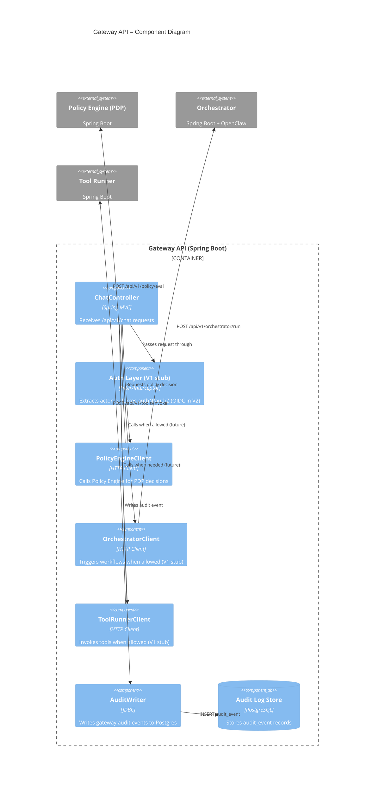
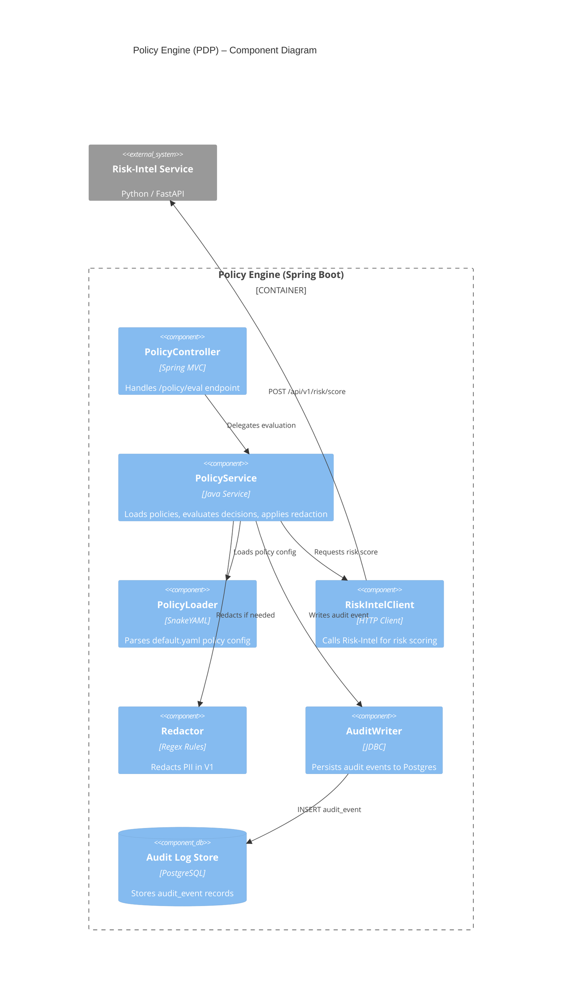
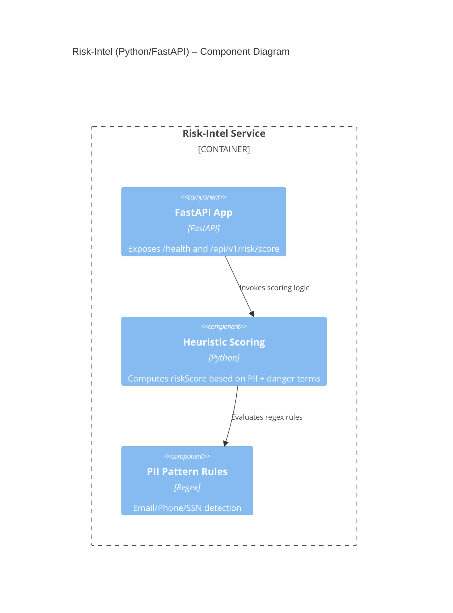
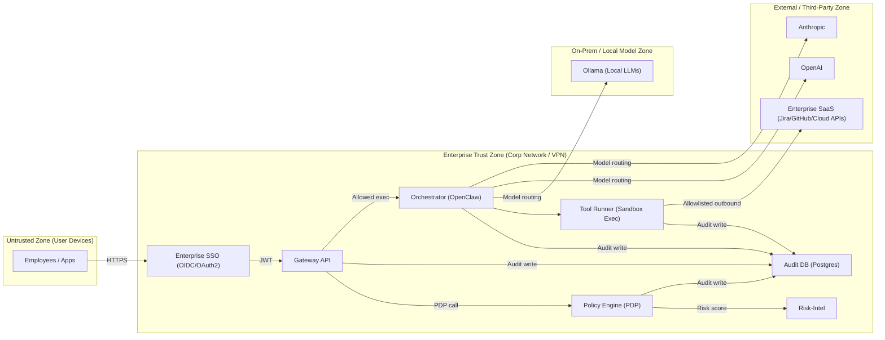
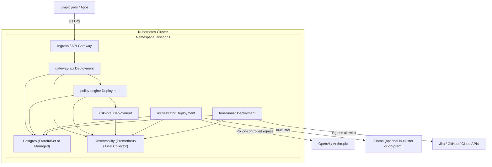

# AISecOps Runtime Gateway Architecture (C4 Model)

This project documents architecture using the **C4 model**:

- Level 1 → Context
- Level 2 → Container
- Level 3 → Component

Additionally, we include:
- Security / Trust Boundary diagram (CISO-friendly)
- Deployment diagram (Platform/SRE-friendly)

---

## Level 1 — Context Diagram

File: `docs/diagrams/system.mmd`

Shows:
- External users (Employees / Apps)
- AISecOps Runtime Gateway (system)
- External LLM providers (OpenAI, Anthropic, Ollama)
- Enterprise SaaS systems (Jira, GitHub, Cloud APIs)

---

## Level 2 — Container Diagram

File: `docs/diagrams/system1.mmd`

Shows deployable units inside the system boundary:
- Gateway API (Spring Boot)
- Policy Engine / PDP (Spring Boot)
- Risk-Intel Service (Python / FastAPI)
- Orchestrator (Spring Boot + OpenClaw)
- Tool Runner (Spring Boot)
- Audit Log Store (PostgreSQL)

---

## Level 3 — Component Diagrams

Below are component-level diagrams for the most critical containers.

---

### Gateway API — Component Diagram

---

### Policy Engine (PDP) — Component Diagram

---

### Risk-Intel Service — Component Diagram

---

## Security / Trust Boundary Diagram

This diagram is designed for security reviews and threat modeling.

---

## Deployment Diagram (Kubernetes-oriented)

This is the production deployment view (can be adapted to ECS/VMs).

---

## What to add next (once V2 features land)

- Gateway API component diagram update for real OIDC (Okta/Azure AD)
- Orchestrator components: workflow engine, tool registry, agent executor
- Tool Runner components: allowlist, Docker runner, network policies
- Model Router components: provider adapters + cost/risk routing
- A dedicated Threat Model doc (`docs/threat-model.md`) with STRIDE/LINDDUN